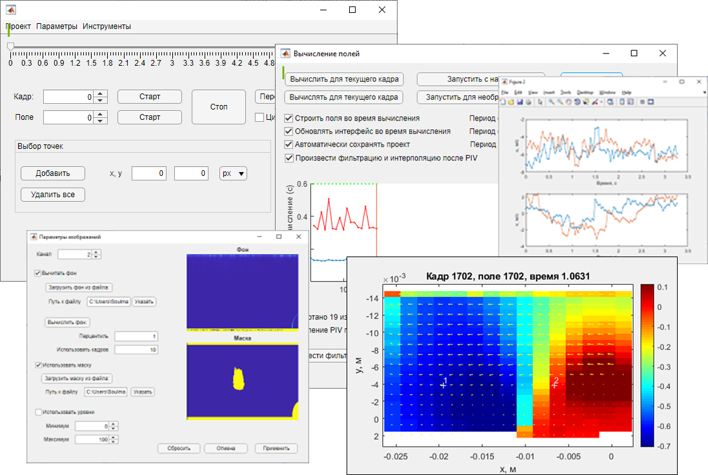

# PIV-GUI
В среде Matlab вычисляет и анализирует скорости движения потока по последовательности PIV изображений.

[Детальное описание в docx файле](info/Description.docx)

## Структура
### PIV_main – основной модуль
  - core    Core – ядро основного модуля
    -  il  Image_loader – модуль загрузки изображений
    -  ipp Image_preprocessor – модуль обработки изображений
    -  piv_processor       PIV_processor – модуль вычисления PIV
    -  fi_processorFilter_and_interpolation_processor  -  модуль фильтрации и интерполяции
    -  transform_processor Transform_processor – модуль преобразования координат
    -  exporter    Exporter – модуль экспорта данных
    -  analyzer    Analyzer – модуль анализа данных
  - piv_plot     PIV_plot – модуль построения данных PIV
  - p Project_params – параметры проекта
    - rp      Record_params - параметры записи
    - il      Image_loader_params – параметры загрузки изображений
    - ipp     Image_preprocessor_params – параметры обработки изображений
    - pp      PIV_params – параметры вычисления PIV
    - pg      PIV_grid – параметры сетки PIV
    - pf      PIV_frames – параметры кадров, между которыми производится вычисление PIV
    - fi      Filter_and_interpolation_params – параметры фильтрации и интерполяции
    - ap      Analyzer_params – параметры анализа данных
    - ep      Export_params – параметры экспорта данных
    - plot_params    Plot_params – параметры построения полей скорости
### Окна графического интерфейса
- db_proj_new  PIV_db_proj_new – окно создания нового проекта
- db_proj_edit PIV_db_proj_edit – окно редактирования параметров проекта
- db_piv_grid  PIV_db_piv_grid – окно редактирования параметров сетки PIV
- db_piv_params PIV_db_piv_params – окно редактирования параметров PIV
- db_ipp PIV_db_ipp – окно редактирования параметров обработки изображений
- db_piv_frames PIV_db_piv_frames – окно редактирования параметров кадров PIV
- db_plot PIV_db_plot – окно редактирования параметров построения полей
- db_process PIV_db_process – окно проведения PIV
- db_fi_params PIV_db_fi_params – окно параметров фильтрации и интерполяции
- db_export  PIV_db_export – окно экспорта данных
- db_analyze PIV_db_analyze – окно анализа данных
- PIV_main_App.mlapp– основное окно приложения
